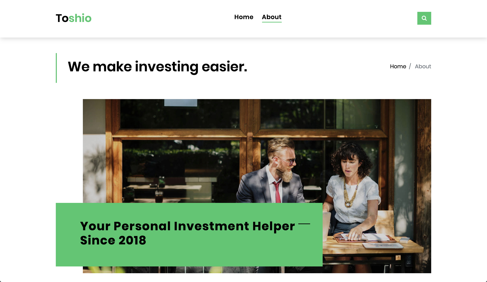
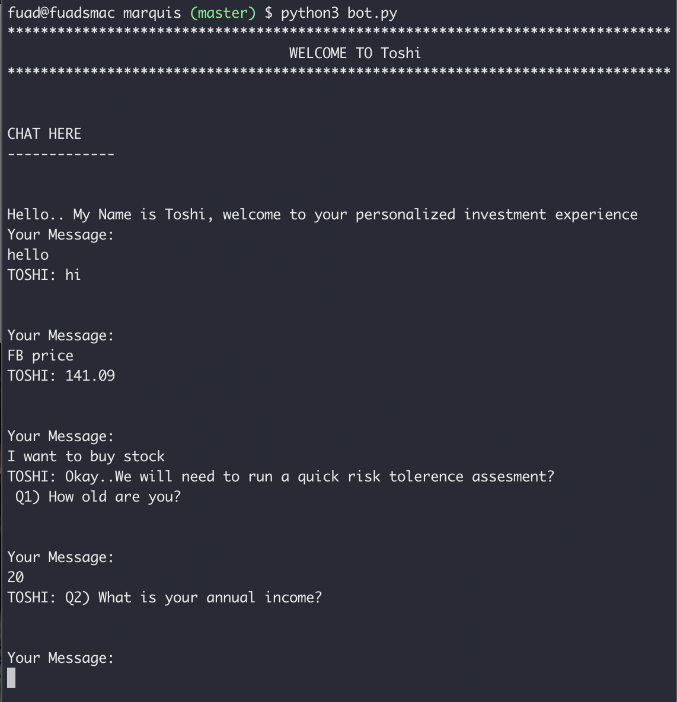

# Toshi
 Toshi. A chatbot created at YHacks 2018 to tackle the Goldman Sachs Marquee API Challenge. Uses Natural Language Processing to give you access to real-time investment information, manage your portfolio, and analyze growth and risk.
 
 ## YHack 2018 -- Yale University 
 
 

 Toshi is tackling Goldman Sach's challenge at YHacks 2018 to utilize their Global Investment Research Factor Percentiles. 

 ## About
 The aim of Marquis is to equalize the investment landscape for those with limited access to real time information. Our chatbot is aimed to remove barriers to financial literacy by providing 4 key contact points.

### Toshi Encourages Financial Literacy via:
 * Education: Learn more about investments by asking Toshi simple questions
 * Pricing: Ask Toshi the price of any stock, and it'll tell you!
 * Portfolio Management: Organize your portfolio according to growth, and Goldman Sachs custom multiples
 * Risk Analysis: Analyze stocks according to risk! Toshi will even coduct a *risk tolerance survey*on you before you begin to invest, asking you questions like "What is your income?" and "What are your finnacial goals?"
 
 

 ### Technology
 * Python backend
 * Marquee API from Goldman Sachs
 * Pricing information from IEX
 * NTLK for Natural language processing

 ### Next Steps

 We really hope to be able to continue this project in the near future. In the interest of improving accessiblity, we hope to make Toshi an * SMS based service * so that even those without smartphones can access information at their fingertips. This also eliminates the need for a persistent internet connection.

 *Huge shoutout to the YHack team, including Fuad Ali, Aravin Sivakumar, Isaac Cho, and Harshdeep Guraya.*

